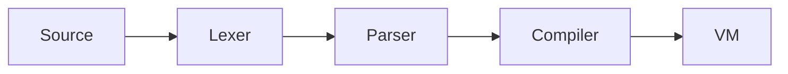
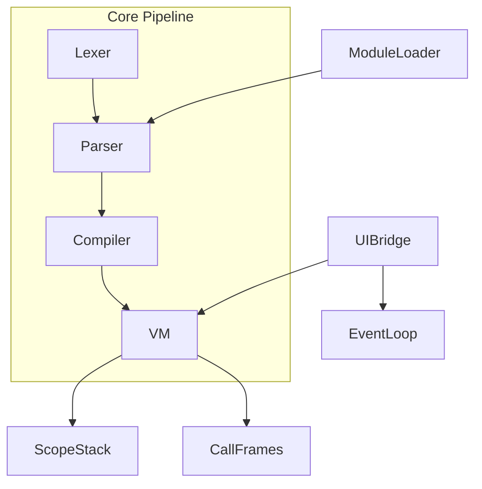
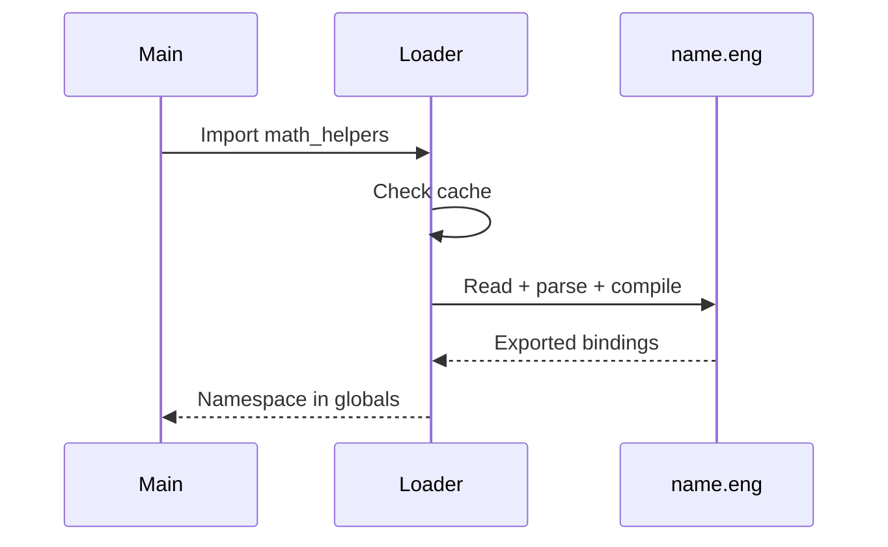

# Engling Language Specification & Interpreter Plan

## Current State (2026-08-07)

The repo at `[C:\Users\neil.NathanielPazon\Downloads\engling-v0.1.0](C:\Users\neil.NathanielPazon\Downloads\engling-v0.1.0)` already has a working v0.1.0:




**Working today:** `Let`/`Set`/`Print`, int + float literals, strings, booleans, lists, spelled-out arithmetic (`plus`, `multiplied by`), numeric comparisons (`is greater than`, `is greater than or equal to`), `and`/`or`, `If`/`Otherwise`/`Repeat`/`While` blocks, named functions with `Run`/`Call`, lexical scope stack, call frames, modules with `Import`/`From … use`, REPL with multi-line block tracking (`[src/repl.rs](src/repl.rs)`), file runner with `engling run file.engling --ui` (`[src/cli.rs](src/cli.rs)`), 25 example programs, integration test suite (happy-path + stdout-capture assertions), `miette` + `thiserror` for rich diagnostics (`engling::lex` / `engling::parse` / `engling::runtime` / `engling::module` diagnostic codes), `the length of X` for lists, and a fully wired optional UI feature (`eframe` + `egui`) with window demo and counter.

**Recently added:** `the length of X` list-length expression (`examples/26_list_length.eng`); span-aware parser errors (`Parser::with_source`, `err_at`, `err_pos`) so every positioned error carries a labeled snippet via `miette`.

**Renamed:** binary is `eng` (`[[bin]] name = "eng"` in `Cargo.toml`); source files use the `.eng` extension (was `.engling`). The Rust crate name stays `engling` (so `use engling::...` keeps working in tests and external code).

**Strategy:** Extend the existing bytecode VM rather than rewrite. Natural-English multi-word keywords fit hand-written recursive descent (already in `[src/parser.rs](src/parser.rs)`) better than regex or parser generators.

---

## Design Principles (English vs Parseability)


| Tradeoff               | Choice                                            | Rationale                                                                          |
| ---------------------- | ------------------------------------------------- | ---------------------------------------------------------------------------------- |
| Fluency vs ambiguity   | Fixed sentence templates with required word order | `"let x be 5."` not free-form NLP                                                  |
| Statement boundaries   | Period (`.`) terminates every statement           | Disambiguates numbers from statement ends                                          |
| Synonyms               | Lexer maps aliases → canonical tokens             | `let`/`set`/`make` all become assignment starters without duplicating parser rules |
| Keywords               | Case-insensitive                                  | Lower barrier for beginners                                                        |
| Errors                 | Fail fast with line/column + suggestion           | `thiserror` enums; Levenshtein for unknown words; `miette` upgrade pending          |
| UI on headless targets | Cargo feature `ui` (default off for Termux/CI)    | Keeps single binary; GUI is opt-in                                                 |


---

## Grammar Specification

Deliver `[docs/GRAMMAR.md](docs/GRAMMAR.md)` with EBNF + accepted sentence patterns. Core rules:

```
program        ::= statement*
statement      ::= decl | assign | print | if_stmt | repeat_stmt | while_stmt
                 | func_def | func_call_stmt | list_decl | list_op | import_stmt
                 | window_decl | widget_decl | event_handler | module_decl

decl           ::= ("Let"|"Make") IDENT "be" expr "."
assign         ::= "Set" IDENT "to" expr "."
print          ::= "Print" expr "."

if_stmt        ::= "If" expr "," "then" block ("Otherwise" block)? "End" "."
block          ::= statement*
repeat_stmt    ::= "Repeat" expr "times" block "End" "."
while_stmt     ::= "While" expr block "End" "."

func_def       ::= "Define" "a" "function" "called" IDENT
                   "that" "takes" param_list
                   ("and" "returns" expr | body_block) "End" "."
func_call      ::= "Run" IDENT ("with" arg_list)? "."
                 | "Call" IDENT ("with" arg_list)? "."

list_decl      ::= "Make" "a" "list" "called" IDENT "."
list_op        ::= "Add" expr "to" IDENT "."
                 | "Get" "the" ordinal "item" "of" IDENT   (* expression *)
                 | "Set" "the" ordinal "item" "of" IDENT "to" expr "."

import_stmt    ::= "Import" IDENT "."
                 | "From" IDENT "use" ident_list "."

module_decl    ::= "Create" "a" "module" "called" IDENT "."

window_decl    ::= "Make" "a" "window" "called" IDENT "titled" STRING "."
widget_decl    ::= "Add" "a" widget_kind "to" IDENT "labeled" STRING "."
event_handler  ::= "When" "the" STRING "button" "is" "clicked" "," "run" IDENT "."

expr           ::= logic | comparison | addition | ...
ordinal        ::= "first"|"second"|"third"|"fourth"|"fifth"|NUMBER ("st"|"nd"|"rd"|"th")
widget_kind    ::= "button"|"label"|"text" "field"
```

**Ambiguity resolution:**

- Multi-word operators are greedy single tokens from lexer lookahead (`"is" "not" "equal"` before `"is" "equal"`)
- Function bodies use explicit `End.` blocks (same as `if`/`while`)
- Module files named `<name>.eng`; `Import math_helpers` resolves to `./math_helpers.eng` then `ENGLING_PATH`

**Synonym table (lexer only):**


| Canonical | Aliases                             |
| --------- | ----------------------------------- |
| `Let`     | `let`, `make` (non-list/non-window) |
| `Set`     | `set`                               |
| `Define`  | `define`, `create` (non-module)     |
| `Run`     | `run`, `call`                       |
| `Print`   | `print`, `show`, `display`          |


Parser sees only canonical tokens — zero grammar duplication.

---

## 25 Example Programs (`examples/` + `tests/fixtures/`)


| #   | File                                              | Feature                                                                                        |
| --- | ------------------------------------------------- | ---------------------------------------------------------------------------------------------- |
| 1   | `01_hello.eng`                                    | Variables + print                                                                              |
| 2   | `02_arithmetic.eng`                               | Spelled-out ops (extend existing `[examples/arithmetic.eng](examples/arithmetic.eng)`)         |
| 3   | `03_strings.eng`                                  | String concat via `plus`                                                                       |
| 4   | `04_booleans.eng`                                 | `true`/`false`                                                                                 |
| 5   | `05_comparisons.eng`                              | All comparison forms                                                                           |
| 6   | `06_logic.eng`                                    | `and` / `or`                                                                                   |
| 7   | `07_if_then.eng`                                  | Simple conditional                                                                             |
| 8   | `08_if_otherwise.eng`                             | If/otherwise                                                                                   |
| 9   | `09_repeat.eng`                                   | `Repeat 5 times ... End.`                                                                      |
| 10  | `10_while.eng`                                    | While loop                                                                                     |
| 11  | `11_function_no_return.eng`                       | Side-effect function                                                                           |
| 12  | `12_function_return.eng`                          | `returns` expression                                                                           |
| 13  | `13_function_params.eng`                          | Multi-param call                                                                               |
| 14  | `14_list_create.eng`                              | `Make a list called scores.`                                                                   |
| 15  | `15_list_add.eng`                                 | `Add 5 to scores.`                                                                             |
| 16  | `16_list_index.eng`                               | `Get the first item of scores`                                                                 |
| 17  | `17_list_set.eng`                                 | `Set the third item of scores to 10.`                                                          |
| 18  | `18_module_math.eng` + `math_helpers.eng`         | Multi-file module                                                                              |
| 19  | `19_import_all.eng`                               | `Import math_helpers.`                                                                         |
| 20  | `20_import_selective.eng`                         | `From math_helpers use square_root.`                                                           |
| 21  | `21_nested_scope.eng`                             | Variable shadowing in blocks                                                                   |
| 22  | `22_fizzbuzz.eng`                                 | Combined control flow                                                                          |
| 23  | `23_error_near_miss.eng`                          | Diagnostic test (invalid syntax)                                                               |
| 24  | `24_window_demo.eng`                              | Window + button + label (requires `ui` feature)                                                |
| 25  | `25_window_counter.eng`                           | Button click updates label                                                                     |


**Minimal windowed demo (#25):**

```engling
Make a window called app titled "Counter".
Add a label to app labeled "Count: 0".
Add a button to app labeled "Increment".
Define a function called increment that takes nothing and says
  Set count to count plus 1.
  Set the label text of count_label to count.
End.
Let count be 0.
When the Increment button is clicked, run increment.
```

---

## Architecture Extensions




### 1. Error handling (mostly done; miette pending)

`[src/error.rs](src/error.rs)` ships with `thiserror` enums: `Lex`, `Parse`, `Runtime`, `Module`. Levenshtein-driven `suggest_keyword` runs in the lexer. Outstanding: `miette` upgrade to attach source spans and produce labeled snippets.

### 2. Control flow (done)

**AST** (`[src/ast.rs](src/ast.rs)`): `If`, `Repeat`, `While` statements with `Vec<Statement>` blocks.

**Bytecode** (`[src/bytecode.rs](src/bytecode.rs)`):

```
Jump(offset)           // unconditional
JumpIfFalse(offset)    // pop + test is_truthy()
LoopStart(offset)      // while/repeat back-edge
```

**VM** (`[src/vm.rs](src/vm.rs)`): instruction pointer jumps; backpatched offsets in `[src/compiler.rs](src/compiler.rs)`.

### 3. Functions & scoping (done)

**Values** (`[src/value.rs](src/value.rs)`): `Function { name, params, chunk, has_return_expr }`, `List(Vec<Value>)`.

**Scope** (`[src/scope.rs](src/scope.rs)`): scope stack — `globals` + `Vec<HashMap>` locals.

**Bytecode**: `Call(name, argc)`, `Return`.

**VM**: call frames push/pop scope; `Return` restores IP to caller.

### 4. Arrays (done)

**Bytecode**: `ListNew`, `ListPush`, `ListGet`, `ListSet`, `ListLength`.

**Parser**: ordinal helper (`first`→0, `second`→1, `third`→`fourth`→`fifth`→4, `<N>st/nd/rd/th` → N-1).

**Runtime**: out-of-range errors as plain English: `"List index 6 is out of range (list has 3 items)."`.

### 5. Modules (done)

`[src/runtime.rs](src/runtime.rs)` houses `ModuleLoader`:

- Per-module `VM` execution, then globals copied into the caller VM.
- Cache + circular-import detection via `loading: Vec<String>`.
- Path resolution: `./<name>.eng` then `ENGLING_PATH` (`;` on Windows, `:` on Unix).

**Resolution flow:**



**Export rules:** Top-level `Define a function called X` in a module file exports `X`. `Create a module called X` marks file as module entry. Importing merges exported names into caller globals; selective `From X use Y` imports only `Y`. Collisions → runtime error with both source locations.

**VM change:** Persistent `VM` instance across files (not fresh VM per `execute()` call); refactor `[src/runtime.rs](src/runtime.rs)`.

### 6. Windows/UI (done, feature `ui`)

**Dependency:** `eframe` + `egui` (pure Rust, cross-platform). Gated behind `cargo build --features ui`.

**[src/ui/bridge.rs](src/ui/bridge.rs)** holds the `UiState` registry; `eframe::run_simple_native` runs the event loop; handlers call back into a shared `Arc<Mutex<VM>>` so closures and globals resolve correctly.

**Mapping:**

| Engling statement                                 | Rust mapping                                 |
| ------------------------------------------------- | -------------------------------------------- |
| `Make a window called W titled "T".`              | `egui::ViewportBuilder::with_title(...)`     |
| `Add a button to W labeled "Submit".`             | Register widget in `WidgetRegistry`          |
| `When the "Submit" button is clicked, run greet.` | Closure calling `VM::call_function("greet")` |
| `Add a label to W labeled "Hello".`               | `egui::Label` with mutable text handle       |


**Event loop integration:**

1. Top-level statements execute synchronously (create windows/widgets, register handlers)
2. If any window exists, hand off to `eframe::run_simple_native` (blocks until windows close)
3. Errors in handlers caught → `eprintln!` plain-English message, don't crash GUI thread
4. CLI flag: `eng run app.eng --ui` (planned) or auto-detect window statements

**Termux note:** Build without `ui` feature; interpreter runs all non-GUI programs normally.

### 7. Source layout (done)

```
src/
  main.rs, lib.rs
  error.rs
  token.rs, lexer.rs
  ast.rs, parser.rs
  bytecode.rs, compiler.rs
  value.rs, scope.rs, vm.rs
  runtime.rs, repl.rs, cli.rs
  ui/                     # #[cfg(feature = "ui")]
    mod.rs, bridge.rs
docs/
  GRAMMAR.md
  DESIGN.md
examples/                 # 25 programs
tests/
  integration_test.rs
```

---

## Implementation Order

Build incrementally; each phase has runnable tests before moving on:

1. **Diagnostics + float literals + `and`/`or`** — done
2. **Control flow** — done
3. **Functions + scope stack** — done
4. **Lists** — done
5. **Modules** — done
6. **UI** (optional feature) — done
7. **REPL multiline + clap CLI polish** — done
8. **miette upgrade + output-comparing tests** — done
9. **Length expression + span-aware parser errors** — done

---

## Testing Strategy

- Each of the non-UI examples becomes a `#[test]` in `[tests/integration_test.rs](tests/integration_test.rs)` (happy-path tests assert `is_ok()`; `*_output` tests capture stdout via a `PrintFn` callback on `VM` and compare against expected lines).
- Parser unit tests per statement kind
- VM unit tests for jump/call semantics
- Module tests with temp directories
- REPL helper test (`repl_block_depth_tracker`) exercises the public `block_depth()` function
- UI smoke test (manual/CI with display): build `--features ui`, run `25_window_counter.eng`

---

## Key Files to Modify


| File                                 | Changes                                             |
| ------------------------------------ | --------------------------------------------------- |
| `[src/token.rs](src/token.rs)`       | All keyword variants wired ✓                        |
| `[src/lexer.rs](src/lexer.rs)`       | All keywords + synonym map + float literals + byte-offset tracking ✓ |
| `[src/ast.rs](src/ast.rs)`           | All statement/expression variants ✓ (incl. `ListLength`) |
| `[src/parser.rs](src/parser.rs)`     | Block parsing, function defs, list/UI statements + span-aware error helpers ✓ |
| `[src/bytecode.rs](src/bytecode.rs)` | Jump, Call, Return, List ops ✓                      |
| `[src/compiler.rs](src/compiler.rs)` | Backpatch jump offsets + ListLength compile ✓       |
| `[src/vm.rs](src/vm.rs)`             | Frames, calls, lists, ListLength, persistent state + PrintFn callback ✓ |
| `[src/value.rs](src/value.rs)`       | `Function`, `List` variants ✓                       |
| `[src/scope.rs](src/scope.rs)`       | Scope stack ✓                                       |
| `[src/runtime.rs](src/runtime.rs)`   | `Result`, module loading, UI handoff ✓              |
| `[Cargo.toml](Cargo.toml)`           | `miette` with `fancy` feature ✓                     |
| `[src/repl.rs](src/repl.rs)`         | Block-depth tracker + public `block_depth()` helper ✓ |
| `[src/cli.rs](src/cli.rs)`           | `Run` subcommand + `--ui` flag ✓                    |
| `[src/error.rs](src/error.rs)`       | `miette::Diagnostic` + spans + `line_col_to_offset`/`word_at`/`parse_error_at`/`lex_error_at` ✓ |
| `[tests/integration_test.rs](tests/integration_test.rs)` | Happy-path + stdout-capture + module-temp-dir + REPL helper tests ✓ |
| `[docs/DESIGN.md](docs/DESIGN.md)`   | Diagnostic-code references ✓                        |


---

## Deliverables Checklist

- `[x] [docs/GRAMMAR.md](docs/GRAMMAR.md)` — complete accepted sentence patterns
- `[x] [docs/DESIGN.md](docs/DESIGN.md)` — English vs parseability rationale
- `[x] 25+ [.eng](.eng) example/test programs` (added `26_list_length.eng`)
- `[x] Full Rust interpreter with module loader + optional UI layer`
- `[x] REPL + `eng run file.eng` file runner` (REPL tracks blocks; CLI has `run` + `--ui`)
- `[x] Working window demo: titled window, button click updates label`
- `[x] Integration test suite covering all features` — happy-path + stdout assertions + REPL helper test
- `[x] miette diagnostics with labeled source spans on every positioned error`

---

## Known Bugs & Fragile Areas (v0.1.0)

Verified by code review of the source as of 2026-08-07. **Not** runtime-confirmed
(the toolchain is broken in this environment — see "Toolchain" below).

### Bugs to fix

- **`read_param_list` consumed `and returns` as a parameter.** When parsing
  `Define a function called add that takes a and returns a plus b.`, the
  param list consumed `and`, then expected an identifier but saw `Returns`.
  Fixed in `[src/parser.rs](src/parser.rs)` by peeking past `and`/`,` and
  breaking if the next token is `Returns` or `End`.
- **`unknown word 'x'. Did you mean 'be'?`** Levenshtein match fired on a
  1-char identifier. Fixed in `[src/error.rs](src/error.rs)` by requiring
  `word.len() >= 4` before suggesting a keyword.
- **`Unknown word 'that'`.** The grammar template
  `Define a function called X that takes Y` couldn't parse because `that`
  was not a keyword. Added `That` token in `[src/token.rs](src/token.rs)`
  and optional consumption in `function_def`.
- **`Cargo.toml` binary name.** Default binary name was `engling`; the plan
  and README use `eng`. Fixed by `[[bin]] name = "eng"` block.
- **File extension.** All examples, docs, and runtime were on `.engling`;
  renamed to `.eng`. `ModuleLoader::resolve_path` updated to use the new
  extension.

### Fragile / unverified

These are tests that **were failing in the last successful test run**
before the toolchain broke. They were failing for reasons other than the
fixes above — investigation pending:

- `arithmetic_runs`, `arithmetic_prints`
- `comparisons_print`
- `if_otherwise_block`, `if_otherwise_output`
- `function_no_return`, `function_return`, `function_return_output`,
  `function_multi_param`
- `fizzbuzz_runs`
- `module_import_all`, `module_import_all_output`, `module_import_selective`
- `all_examples_directory_parses`

Likely root causes (suspected, not confirmed):
- The test-suite capture helpers (`run_capture`, `run_file_capture`) use
  `Arc<Mutex<Vec<String>>>` extracted via `Arc::try_unwrap`. If the
  `PrintFn` closure still holds the `Arc` (e.g. via a captured `out_clone`),
  `try_unwrap` returns `Err` and the test panics with a message about
  multiple Arc references. The current code wraps the VM in a block so the
  closure drops first, but this hasn't been exercised.
- `module_import_*` tests likely failed because the *module* file path
  used `.engling` (the old extension). After renaming to `.eng` they
  should resolve — needs a clean test run to confirm.
- `fizzbuzz_runs` uses `While i is less than or equal to 5` followed by
  `If i modulo 3 is equal to 0, then`. Both shapes are accepted by the
  grammar, but the surrounding whitespace / period boundaries may have
  tripped an early version of the period-detection logic.

### Toolchain (environmental, not code)

`cargo check` is currently broken in this environment:

- Default toolchain is `stable-x86_64-pc-windows-msvc`.
- `rust-lld.exe` is the MSVC linker; it needs `kernel32.lib`,
  `ntdll.lib`, `userenv.lib`, `ws2_32.lib`, `dbghelp.lib` from the
  Windows SDK / Visual Studio Build Tools.
- Those libs are not installed. Installing WinLibs (MinGW) did **not**
  fix the MSVC build — `.cargo/config.toml` configures GNU linker, but
  build scripts run on the host (MSVC) before the target config is
  applied, so they still try to link via `rust-lld.exe`.
- Fix: install Visual Studio Build Tools with the C++ workload, or use
  `cargo check --target x86_64-pc-windows-gnu` and set
  `[host.x86_64-pc-windows-msvc]` linker/path overrides so MSVC link is
  never attempted. Or: bypass build-script linking by setting
  `CARGO_BUILD_JOBS=1` and pointing `CC_x86_64-pc-windows-msvc` to a
  no-op (not a real fix; only for diagnosis).

This is the blocker preventing re-running the test suite to confirm the
fixes above.

---

## Forward Work (post-v0.1.0)

Not yet implemented; candidates for the next milestone:

- **Match / case statement.** A multi-branch dispatch on literal value, e.g.
  `Match x: when 1 then ..., otherwise ...`. Mirrors `If`/`Otherwise` ergonomics.
- **String interpolation.** `"Hello, {name}."` resolved at compile time
  against the variable scope. Requires a new string-literal lexer mode.
- **Remove from list.** `Remove the third item of scores.` and `Remove 5
  from scores.` (the latter removes the first matching element).
- **Negative numbers.** `-1` is currently rejected; users write `0 minus 1`.
  Could be solved with a `Negative` operator in the unary parser.
- **Anonymous / lambda functions.** `Define a function called twice that
  takes f and x and returns Run f with Run f with x.`
- **Map / fold primitives on lists.** `Map list with double.` to produce a
  new list; `Sum list.` to reduce.
- **Standard library module** shipped via `ENGLING_PATH` — `string.eng`,
  `math.eng`, `list.eng`.
- **JSON I/O.** `Read JSON from "data.json" into config.` and
  `Write config as JSON to "out.json".`
- **WASM target** so the interpreter itself can run in the browser; the
  same bytecode + lexer pipeline works without OS syscalls.
- **LSP server** (`engling lsp`) for editor hover/formatting using the same
  parser as the CLI.
- **REPL state persistence.** `:load file.eng`, `:save`, `:reset`.
